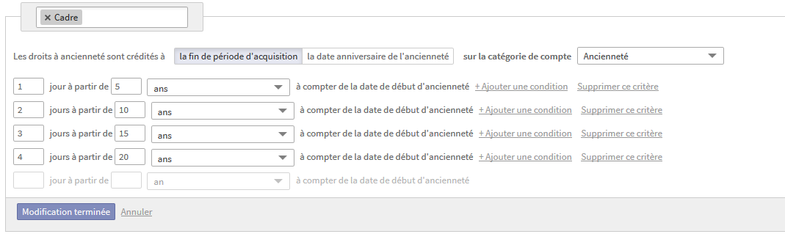
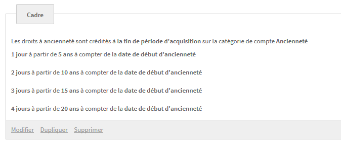

title: "Expression Trees in .NET"
author:
  name: Guillaume Mouron - Lucca
  twitter: GMouron
  email: "guillaume.mouron@gmail.com"
output: expression.trees.html
controls: true
style: styles.css

--

# Expression Trees<br />in .NET
## Human Talks - 2014-07-08
## Guillaume Mouron - Lucca
--

### Presentation
* Guillaume Mouron
    * _Software Engineer_ at _Lucca_ since July 2013


* Lucca makes __SaaS__ products for __managing HR processes__<br />_(leave management, business expenses management, ...)_
    * Backend: _API REST_ in __C#/.NET__
    * Frontend: __JS__ _(backbone, Angular, vanilla)_

--
### Expression Trees
--
### Expression Trees


--

### Expression Trees


#### That's not a tree, that's an Ent

--

### Expression Trees

#Think _LINQ_

--

### LINQ

Behind the scene, LINQ uses *Expression Trees* for each of its operations<sup>0</sup>

Example:
```cs
var userIds = users.Where(u => u.dtContractEnd < DateTime.Now).Select(u => u.id);
//                        ^^^^^^^^^^^^^^^^^^^^^^^^^^^^^^^^^^^         ^^^^^^^^^
//                        Expression<Func<User, bool>>                Expression<Func<User, int>>
```

<sub>[0] Not entirely true, but let's assume it is</sub>
--
### Limitations of LINQ

While powerful, LINQ has some limitations
Example:
```cs
class OfficeRoom {
	RepairStatus status { get; set; }
	bool isBeingRepaired() { return status == RepairStatus.Repairing; }
}
var officelessUsers = users.Where(u => u.officeRoom.isBeingRepaired());
```
With LINQ To Objects, no problem, this works!
--
### Limitations of LINQ
With LINQ To Entities, we get:

`LINQ To Entities does not recognize the method 'Boolean isBeingRepaired()' method, and this method cannot be translated into a store expression.`
--
### Limitations of LINQ
```cs
// DOESN'T WORK
var officelessUsers = users.Where(u => u.officeRoom.isBeingRepaired());
// DOES WORK
var officelessUsers = users.Where(u => u.officeRoom.status == RepairStatus.Repairing);
```
--
### Limitations of LINQ
```cs
// DOESN'T WORK
var officelessUsers = users.Where(u => u.officeRoom.isBeingRepaired());
// DOES WORK
var officelessUsers = users.Where(u => u.officeRoom.status == RepairStatus.Repairing);
```
## 

So there must be a way to combine both dynamically
--
### The Expression visitor
## &nbsp;
##
--
### The Expression visitor
Microsoft provides a way to _explore_ the expression tree and replace some of its nodes

## __The `ExpressionVisitor`__
--
### First, the refactored code using the visitor
```cs
class OfficeRoom {
	RepairStatus status { get; set; }
	static readonly Expression<Func<OfficeRoom, bool>> isBeingRepairedExpr = 
									(o => o.status == RepairStatus.Repairing);
}
```
```cs
var officelessUsers = users.Where(
  ExprHelper.ApplyExprToProp<User, OfficeRoom>(u => u.OfficeRoom, OfficeRoom.isBeingRepairedExpr)
);
```
--
### Implementing an Expression Visitor
```cs
class ReplacementVisitor : ExpressionVisitor
{
	readonly Expression _oldExpr;
	readonly Expression _newExpr;

	public ReplacementVisitor(Expression oldExpr, Expression newExpr)
	{
		_oldExpr = oldExpr;
		_newExpr = newExpr;
	}

	public override Expression Visit(Expression node)
	{
		return node == _oldExpr ? _newExpr : base.Visit(node);
	}
}
```
--
### Implementing an Expression Visitor
```cs
class ReplacementVisitor : ExpressionVisitor
{
	readonly Expression _oldExpr;
	readonly Expression _newExpr;

	public ReplacementVisitor(Expression oldExpr, Expression newExpr)
	{
		_oldExpr = oldExpr;
		_newExpr = newExpr;
	}

	public override Expression Visit(Expression node)
	{
		return node == _oldExpr ? _newExpr : base.Visit(node);
	}
}
```
```cs
public class ExprHelper
{
	public static Expression<Func<T, bool>> ApplyExprToProp<T, TNav>(
															Expression<Func<T, TNav>> parent,
															Expression<Func<TNav, bool>> nav)
	{
		// For Info:     parent:	u => u.OfficeRoom
		//                  nav:	o => o.status == RepairStatus.Repairing
		
		var visitor = new ReplacementVisitor(nav.Parameters[0], parent.Body);
		var body = visitor.Visit(nav.Body);
		return Expression.Lambda<Func<T, bool>>(body, parent.Parameters[0]);
	}
}
```
--
### Bonus
We can still use the Expression as a function, this way:
```cs
class OfficeRoom {
    RepairStatus status { get; set; }
    static readonly Expression<Func<OfficeRoom, bool>> isBeingRepairedExpr = 
                                    (o => o.status == RepairStatus.Repairing);

	bool isBeingRepaired() { return OfficeRoom.isBeingRepairedExpr.Compile()(this); }
}
```
--
### A more powerful use case
## &nbsp;
##
--
### What about a _DSL_ ?
1. We want users to be able to enter some business rules
3. Those are dynamic
2. They need a nice, friendly web interface to enter the rules
4. We want to limit the operators and functions available
5. And we want to execute the code in a safe way
--
### We could use ...
A Lex/Yacc type of tools with a grammar

But as powerful as they are, it's cumbersome
--
### Or we can use
# an _Expression Tree_ based rule engine
--
## &nbsp;
##
--
### an _Expression Tree_ based rule engine
From this:
##
##
--
### an _Expression Tree_ based rule engine
We get this:
```json
{
  "return": "MAX",
  "elements": [
    {
      "return": 1,
      "criterion": {
        "unit": "year",
        "name": "seniority",
        "operator": ">=",
        "value": 5
      }
    },
    {
      "return": 2,
      "criterion": {
        "unit": "year",
        "name": "seniority",
        "operator": ">=",
        "value": 10
      }
    },
    {
      "return": 3,
      "criterion": {
        "unit": "year",
        "name": "seniority",
        "operator": ">=",
        "value": 15
      }
    },
    {
      "return": 4,
      "criterion": {
        "unit": "year",
        "name": "seniority",
        "operator": ">=",
        "value": 20
      }
    }
  ]
}
```
--
### an _Expression Tree_ based rule engine
```cs
// For info:  "criterion": {  "unit": "year", "name": "seniority", "operator": ">=", "value": 5 }

var ruleValuesProviderType = typeof(RuleValuesProvider);
var parameter = Expression.Parameter(ruleValuesProviderType);
```
--
### an _Expression Tree_ based rule engine
```cs
// For info:  "criterion": {  "unit": "year", "name": "seniority", "operator": ">=", "value": 5 }

var ruleValuesProviderType = typeof(RuleValuesProvider);
var parameter = Expression.Parameter(ruleValuesProviderType);

var methodInfo = ruleValuesProviderType.GetMethod("GetValue")
					.MakeGenericMethod(new Type[] { typeof(int) });
var memberExpression = Expression.Call(parameter, methodInfo,
							Expression.Constant(c.name), Expression.Constant(c.unit));
```
--
### an _Expression Tree_ based rule engine
```cs
// For info:  "criterion": {  "unit": "year", "name": "seniority", "operator": ">=", "value": 5 }

var ruleValuesProviderType = typeof(RuleValuesProvider);
var parameter = Expression.Parameter(ruleValuesProviderType);
var methodInfo = ruleValuesProviderType.GetMethod("GetValue")
					.MakeGenericMethod(new Type[] { typeof(int) });
var memberExpression = Expression.Call(parameter, methodInfo,
						Expression.Constant(c.name), Expression.Constant(c.unit));

var constant = Expression.Constant(int.Parse(c.value));
switch (c.@operator)
{
	case ">=":
		body = Expression.GreaterThanOrEqual(memberExpression, constant);
		break;
	case "<=":
		body = Expression.LessThanOrEqual(memberExpression, constant);
		break;
	case ">":
		body = Expression.GreaterThan(memberExpression, constant);
		break;
	case "<":
		body = Expression.LessThan(memberExpression, constant);
		break;
	case "==":
		body = Expression.Equal(memberExpression, constant);
		break;
	case "!=":
		body = Expression.NotEqual(memberExpression, constant);
		break;
	default:
		throw new NotImplementedException();
}
```
--
### an _Expression Tree_ based rule engine
We can implement "OR" and "AND" as well
```cs
// CompileCriterion is the function shown on the previous slide
var leftExpression = CompileCriterion(c.conditions[0], parameter);
var rightExpression = CompileCriterion(c.conditions[1], parameter);

switch (c.logicalOperator)
{
	case "OR":
		body = Expression.OrElse(leftExpression.Body, rightExpression.Body);
		break;
	case "AND":
		body = Expression.AndAlso(leftExpression.Body, rightExpression.Body);
		break;
	default:
		throw new NotImplementedException();
}
```
--
### an _Expression Tree_ based rule engine
In both case, the final statement is to wrap the Expression in a lambda
```cs
return Expression.Lambda<Func<RuleValuesProvider, bool>>(body, parameter);
```
--
### an _Expression Tree_ based rule engine
In both case, the final statement is to wrap the Expression in a lambda
```cs
return Expression.Lambda<Func<RuleValuesProvider, bool>>(body, parameter);
```

__In around 100 lines of code, we have a rule engine with a DSL__
